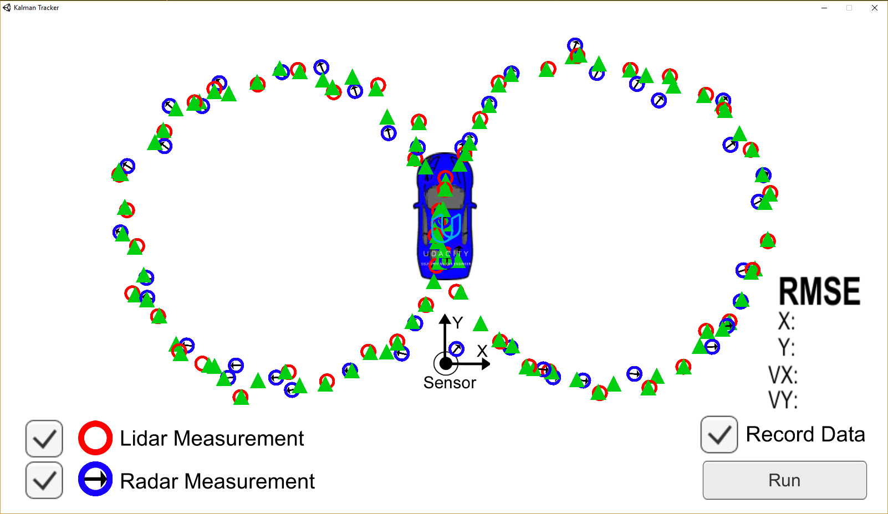

# Extended Kalman Filter Project
Self-Driving Car Engineer Nanodegree Program Term 2 Project 1

In this project, I have implemented an extended kalman filter designed to track a target moving in 2D space. The target represents a pedestrian moving in front of an autonomous vehicle and is given by set of simulated position and velocity data. The simulated data is a mixture of RADAR and LIDAR data, creating the need for sensor fusion. The results of the kalman filter state estimation are saved to a text file, but can also be visualized using a 2-D Unity Simulator provided by Udacity. This allows us to visualize the effect of LIDAR and RADAR on the state estimation.

The project is written in C++ and broken into 4 files. The [main.cpp](src/main.cpp) file contains code to read in simulated pedestrian data, iterate through that data, call the kalman filter functions, and store the output. The [FusionEKF.cpp](src/FusionEKF.cpp) file contains code that initializes the kalman filter object and calls the proper predict and update functions depending on the type of sensor information being currently handled. The [kalman_filter.cpp](src/kalman_filter.cpp) file contains code that defines the kalman filter equations (predict, update for LIDAR, update for RADAR). Finally, the [tools.cpp](src/tools.cpp) file contains helper functions for the jacobian calculation (to handle non-linear systems and measurements), the RSME calculation (to check the accuracy of the results), and the get_h function that converts the state vector from Cartesian coordinates to polar coordinates.

Running the Unity simulator produces RADAR and LIDAR data for a figure 8 path and calculates state estimates using the implemented kalman filter. Below is an image showing the results from the simulator using my implementation.

Running the kalman filter with the simulated [data sets](data) provided by Udacity produces the following RMSE results:

RMSE|Data set 1|Data Set 2
--- | -------- | --------
x   | 0.06     | 0.18
y   | 0.06     | 0.19
vx  | 0.53     | 0.48
vy  | 0.54     | 0.83

## Basic Build and Run Instructions

An [executable](ExtendedKF.exe) has been included which can be run to filter the project data with the following command:

`ExtendedKF.exe path/to/input.txt path/to/output.txt`

Additionally the [Unity simulator](kalman_tracker.exe) can be run by executing the following steps:

1. Open the simulator executable
2. Click Record Data in the simulator, a browser will then open to where you want to save your text file output. Make sure the path is the same as where [kalman_tracker.py](kalman_tracker.py) file is.
3. Run kalman_tracker.py with path to your compiled c++ file. `python kalman_tracker.py ExtendedKF.exe`
4. Click Run

The project can be built by executing the following steps:

1. Make a build directory: `mkdir build && cd build`
2. Compile: `cmake .. && make`
   * On windows, you may need to run: `cmake .. -G "Unix Makefiles" && make`
